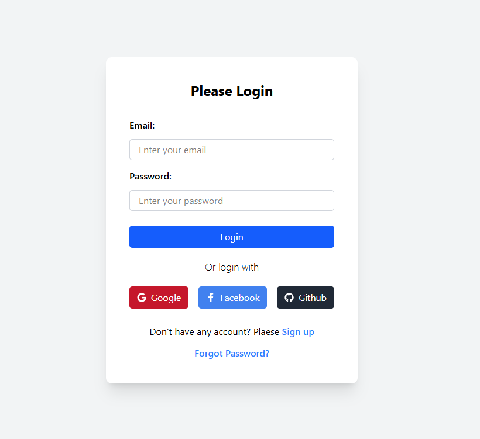
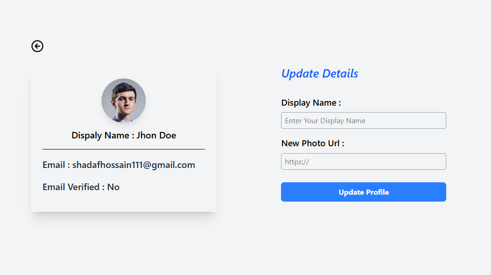

# 🔥 Firebase Authentication App

### A Modern Authentication web app built with React, Firebase, Tailwind CSS, and Context API.
### Users can sign up, log in, and manage their profile using multiple sign-in methods. Includes password reset, profile update, and secure routing — all powered by Firebase.

## 🚀 Features

### ✅ Multiple Authentication Methods

- Sign up / Log in using:

- Google

- Facebook

- GitHub

- Email & Password

### ✅ User Account Management

- Update Display Name

- Update Profile Picture

### ✅ Password Management

- Change Password (after login)

- Reset Password (without login) — via email link

### ✅ Protected Routes

- Access to private pages only for authenticated users

### ✅ Real-time Auth State Tracking

- Automatically detects login/logout using Firebase’s onAuthStateChanged

---
### 🔗 GitHub Repository

👉 [https://github.com/shadafhossain01/Firebase-Authentication-Design](https://github.com/shadafhossain01/Firebase-Authentication-Design)

### 🔗 Live Link

👉 [https://firebase-authentication-design.vercel.app](https://firebase-authentication-design.vercel.app)

---

## 🧰 Technologies Used
| Technology | Description |
|-------------|-------------|
| ⚛️ **React.js** | Frontend Framework |
| 💨 **Tailwind CSS** | Styling |
| 🔥 **Firebase Auth** | Authentication System |
| 🧠 **Context API** | Global State Management |
| 🌐 **React Router DOM** | Routing |


## 📁 Project Structure
 ```
 src/
├── components/
├── context/
│   └── AuthContext.jsx
├── firebase/
│   └── firebase.config.js
├── pages/
│   ├── Login.jsx
│   ├── SignUp.jsx
│   ├── Profile.jsx
│   ├── ForgotPassword.jsx
│   └── Home.jsx
├── App.jsx
└── main.jsx
```
## 🖼️ Screenshots



